# eBank Microservices & AI


Application bancaire distribuée : gestion des **clients** et des **comptes**, exposée en **API REST**, orchestrée avec **Spring Cloud** (Eureka, Gateway, OpenFeign, Resilience4j), enrichie d’un **assistant Spring AI** (OpenAI) branché sur des **serveurs MCP**, avec **interface Angular** et bots **Discord** / **Telegram**.

> **Captures d’écran** : tous les visuels du projet sont dans le dossier [`images/`](./images/) et intégrés ci-dessous. Si les images ne s’affichent pas dans l’aperçu, ouvrez le README depuis la racine du dépôt (`ebank-ms-app/README.md`) et vérifiez que le dossier `images/` est bien présent (à versionner avec `git add images/`).

## Fonctionnalités

| Domaine | Détail |
|--------|--------|
| Clients | Liste, consultation par identifiant, création (`customer-service`) |
| Comptes | Liste, consultation par identifiant (avec enrichissement client via Feign), création (`ebank-service`) |
| Recherche par client | Filtrage possible via l’assistant (outils MCP / liste des comptes) ; pas d’endpoint REST dédié `findByCustomerId` |
| Inter-services | OpenFeign (`customer-service`) depuis `ebank-service` |
| Résilience | Circuit Breaker Resilience4j sur l’appel Feign client |
| Discovery | Serveur Eureka (`discovery-service`) |
| Gateway | Routage dynamique vers les services enregistrés (`DiscoveryClientRouteDefinitionLocator`) |
| MCP | Serveurs MCP STREAMABLE sur `customer-service` et `ebank-service` ; client MCP dans `ebank-bot` |
| IA | Chat, streaming, mémoire par `conversationId` |
| Front | Angular (comptes + chatbot avec Markdown et indicateur de chargement) |
| Messagerie | Discord (JDA via `spring-boot-starter-discord`), Telegram (`telegrambots-spring-boot-starter`) |
| Documentation API | SpringDoc OpenAPI (Swagger UI) sur chaque service exposant une API |

## Architecture

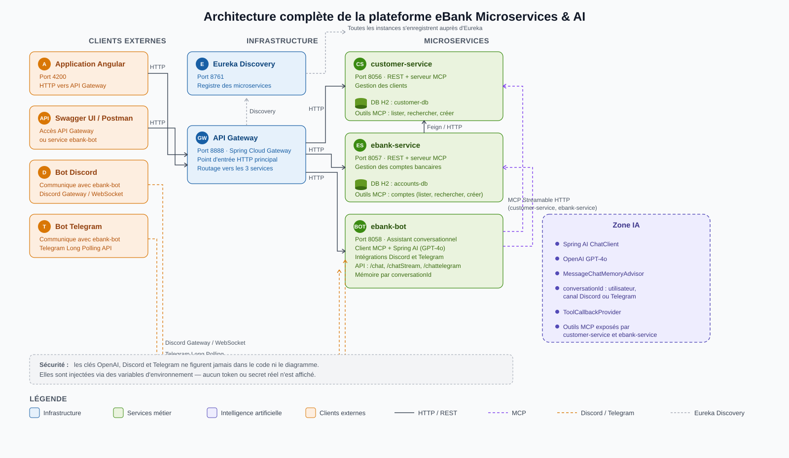

| Composant | Responsabilité | Port (config) |
|-----------|----------------|---------------|
| **angular-front** | UI : liste des comptes, chat vers le bot via la Gateway | `4200` (défaut `ng serve`) |
| **discovery-service** | Registre Eureka | `8761` |
| **gateway-service** | Point d’entrée HTTP, CORS, routage discovery | `9999` |
| **customer-service** | Clients, JPA/H2, MCP clients, Swagger | `8056` |
| **ebank-service** | Comptes, JPA/H2, Feign + circuit breaker, MCP comptes, Swagger | `8057` |
| **ebank-bot** | Chat REST, Spring AI, client MCP, Discord, Telegram, Swagger | `8058` |
| **Discord** | Canal utilisateur → agent IA | — (API Discord) |
| **Telegram** | Messages → agent IA | — (API Telegram) |
| **OpenAI** | Modèle `gpt-4o` (config `ebank-bot`) | — |
| **H2** | Bases mémoire `customer-db`, `accounts-db` | embarquées |
| **MCP** | `/mcp` sur `8056` et `8057` ; consommés par `ebank-bot` | `8056`, `8057` |

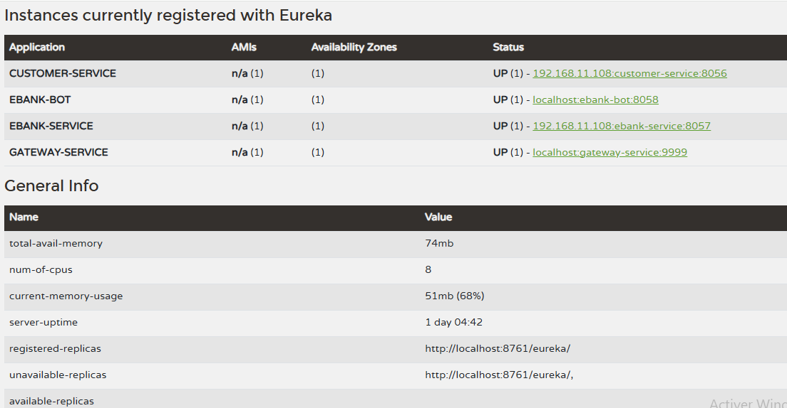

## Services et ports

| Service | `spring.application.name` | Port |
|---------|---------------------------|------|
| discovery-service | `discovery-service` | **8761** |
| gateway-service | `gateway-service` | **9999** |
| customer-service | `customer-service` | **8056** |
| ebank-service | `ebank-service` | **8057** |
| ebank-bot | `ebank-bot` | **8058** |
| angular-front | — | **4200** (Angular CLI) |

## Flux principaux

1. **Angular** appelle la Gateway (`9999`), ex. `/EBANK-SERVICE/accounts`, `/EBANK-BOT/chat` ou `/EBANK-BOT/chatStream`.
2. La **Gateway** résout la route via Eureka et forward vers le microservice cible.
3. **ebank-service** appelle **customer-service** avec **OpenFeign** (`GET /customers/{id}`), avec repli Circuit Breaker si indisponible.
4. **ebank-bot** se connecte aux serveurs MCP en HTTP streamable (`http://localhost:8056/mcp`, `http://localhost:8057/mcp`).
5. **Spring AI** invoque les outils MCP exposés sur les services métier.
6. **OpenAI** produit la réponse ; la mémoire est scoped par `conversationId`.
7. Réponse renvoyée vers **Angular**, **Swagger**, **Discord** ou **Telegram**.

> Dans le dépôt, `ebank-bot` a `eureka.client.enabled=false` et `spring.cloud.discovery.enabled=false` : les appels Angular passent par la Gateway avec le préfixe `/EBANK-BOT/…`. Pour que ce routage fonctionne, le bot doit être visible dans Eureka (réactiver le client Eureka) ou le front doit cibler directement `http://localhost:8058`.

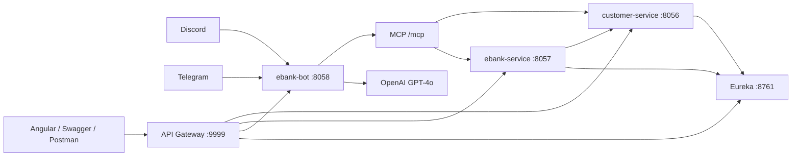

## Technologies utilisées

Java 26 · Spring Boot 4.1.1 · Spring Cloud 2025.1.3 · Spring Cloud Gateway · Netflix Eureka · Spring Data JPA · H2 · OpenFeign · Resilience4j (Circuit Breaker) · Spring AI 2.0.1 · OpenAI · MCP (serveur + client) · Angular 22 · Bootstrap · ngx-markdown · spring-boot-starter-discord · Telegram Bots · SpringDoc OpenAPI 3.1.1 · Maven

## Prérequis

- **JDK 26** (version déclarée dans les `pom.xml` des services)
- **Maven** ou **Maven Wrapper** (`mvnw` / `mvnw.cmd`) dans chaque module
- **Node.js** et **npm** pour `angular-front` (Angular CLI 22)
- Clé **OpenAI** pour `ebank-bot`
- Token **Discord** si utilisation du bot Discord
- Token et nom d’utilisateur **Telegram** si `telegrambots.enabled=true`

## Configuration des variables d’environnement

Ne pas committer de secrets. Exemple pour `ebank-bot` (IntelliJ *Run Configuration*, variables système ou fichier local non versionné) :

```properties
spring.ai.openai.api-key=${OPENAI_API_KEY}
spring.ai.openai.chat.options.model=gpt-4o
discord.token=${DISCORD_BOT_TOKEN}
discord.gateway-intents=MESSAGE_CONTENT,GUILD_MESSAGES
telegram.token=${TELEGRAM_BOT_TOKEN}
telegram.username=${TELEGRAM_BOT_USERNAME}
telegrambots.enabled=true
```

Connexions MCP (valeurs par défaut du projet) :

```properties
spring.ai.mcp.client.streamable-http.connections.customer.url=http://localhost:8056/mcp
spring.ai.mcp.client.streamable-http.connections.ebank.url=http://localhost:8057/mcp
```

## Installation

1. Cloner le dépôt.
2. Définir les variables d’environnement (OpenAI, Discord, Telegram selon les canaux utilisés).
3. Vérifier que les ports **8761**, **8056**, **8057**, **8058**, **9999** et **4200** sont libres.
4. Démarrer les services **dans l’ordre recommandé** (voir ci-dessous), depuis le répertoire de chaque module.

**Windows** (ex. `discovery-service`) :

```bash
mvnw.cmd spring-boot:run
```

**Linux / macOS** :

```bash
./mvnw spring-boot:run
```

**Frontend Angular** (`angular-front`) :

```bash
npm install
npm start
```

Puis ouvrir `http://localhost:4200/` (port par défaut du CLI Angular).

## Démarrage recommandé

| Ordre | Service | Port | Rôle |
|------|---------|------|------|
| 1 | discovery-service | 8761 | Registre des instances |
| 2 | customer-service | 8056 | Données clients + MCP |
| 3 | ebank-service | 8057 | Comptes + Feign + MCP |
| 4 | gateway-service | 9999 | API unifiée |
| 5 | ebank-bot | 8058 | IA, MCP client, Discord/Telegram |
| 6 | angular-front | 4200 | Interface utilisateur |

Démarrer **customer-service** avant **ebank-service** (données clients requises à la création de comptes). Démarrer **8056** et **8057** avant **ebank-bot** (serveurs MCP).

## Utilisation

### Swagger

| Service | URL directe |
|---------|-------------|
| customer-service | `http://localhost:8056/swagger-ui/index.html` |
| ebank-service | `http://localhost:8057/swagger-ui/index.html` |
| ebank-bot | `http://localhost:8058/swagger-ui/index.html` |

Via la Gateway (si le service est enregistré dans Eureka), préfixer avec le nom Eureka, par ex. `http://localhost:9999/CUSTOMER-SERVICE/...`.

| customer-service | ebank-service | ebank-bot |
|------------------|---------------|-----------|
| 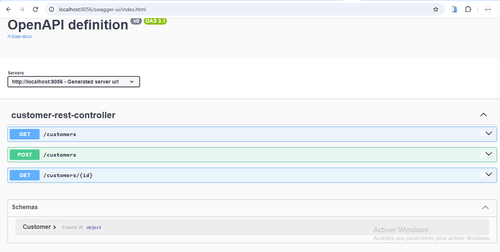 | 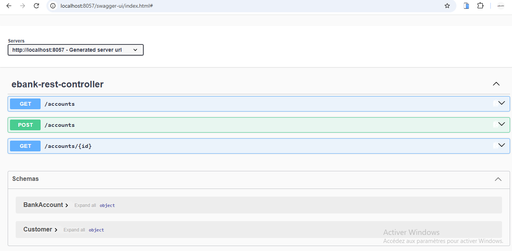 | 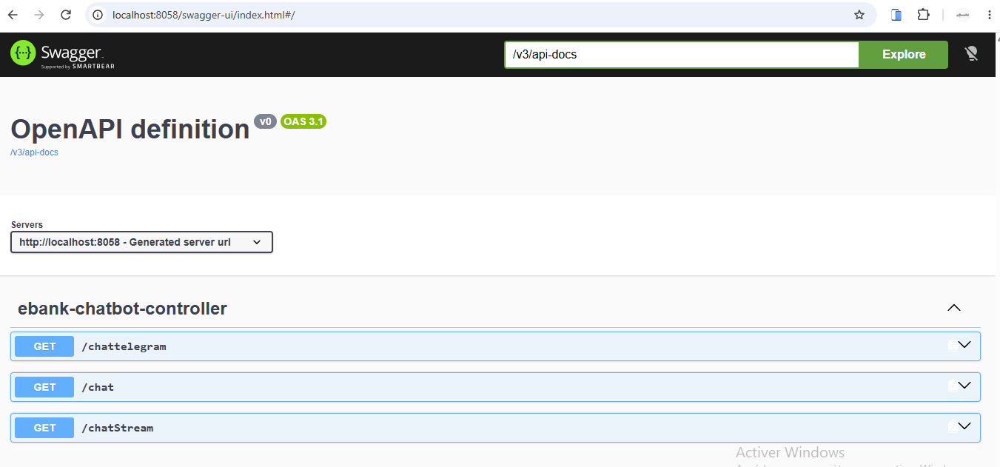 |

### Gateway (exemples)

- `GET http://localhost:9999/CUSTOMER-SERVICE/customers`
- `GET http://localhost:9999/EBANK-SERVICE/accounts`

| Liste clients | Liste comptes |
|---------------|---------------|
| 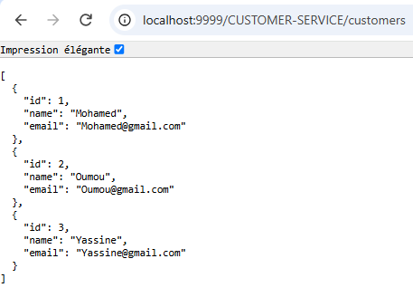 | 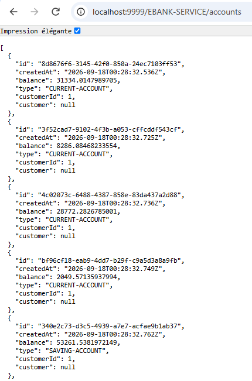 |

### Interface Angular

Routes : `/accounts`, `/bot-ui`. Les appels HTTP ciblent `http://localhost:9999/EBANK-SERVICE/accounts` et `http://localhost:9999/EBANK-BOT/chat` ou `chatStream`.

| Liste des comptes | Chat + consultation comptes |
|-------------------|-----------------------------|
| 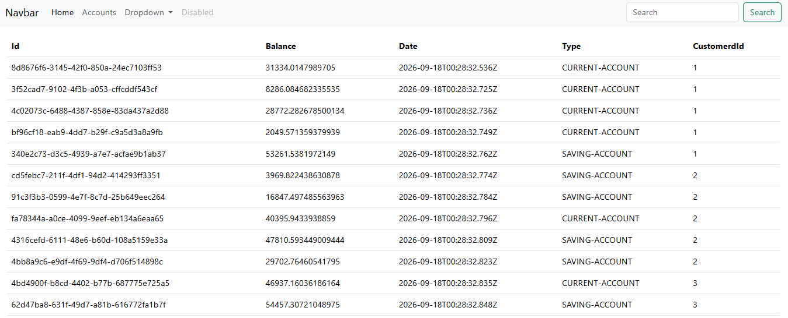 | 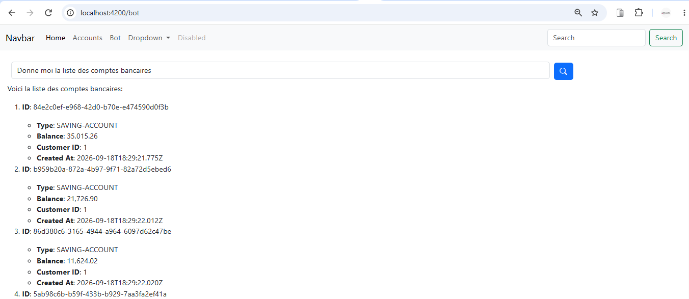 |

| Comptes d’un client (assistant) | Ajout de compte via le chat |
|--------------------------------|-----------------------------|
| 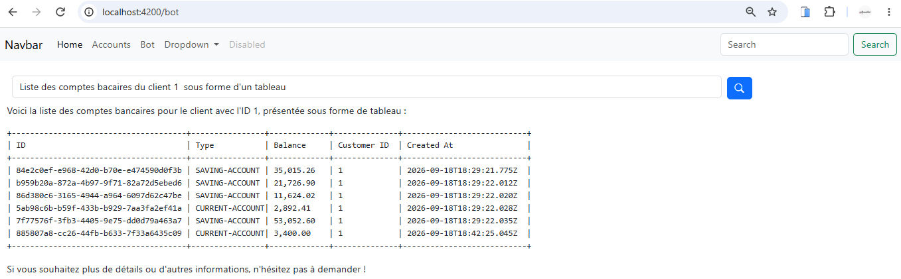 | 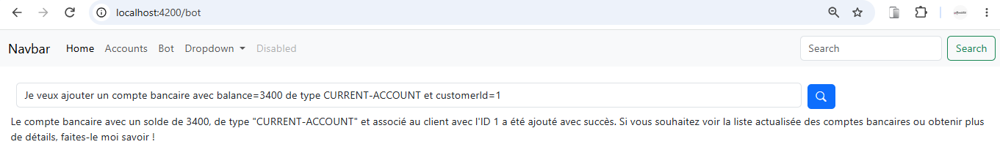 |

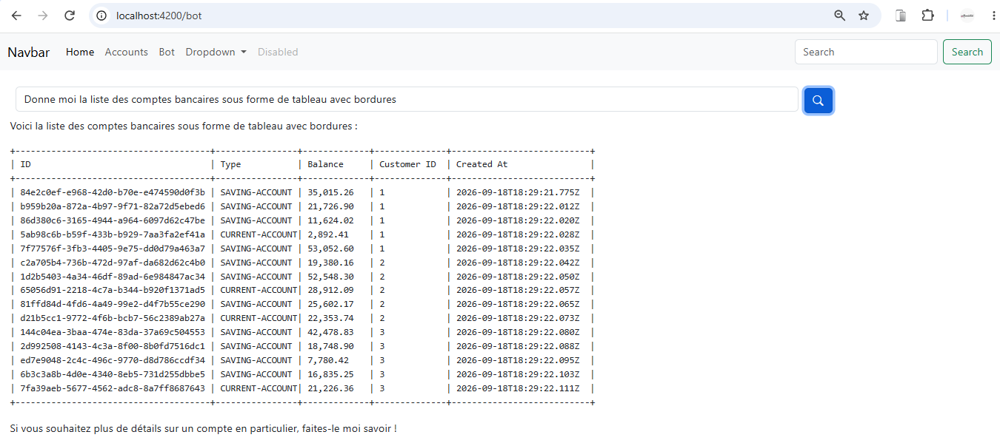

### Discord et Telegram

Invoquer le bot dans un salon Discord configuré, ou envoyer un message au bot Telegram (après activation et token valides).

| Discord | Telegram |
|---------|----------|
| 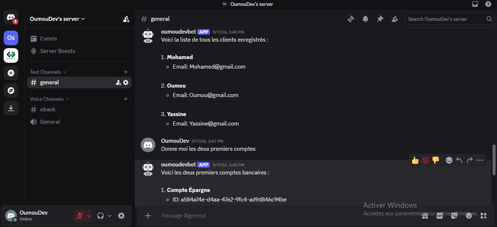 | 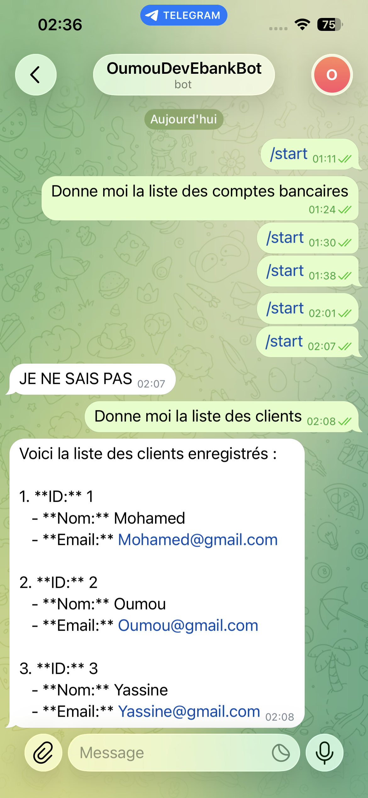 |

### MCP (Postman)

Tester les endpoints MCP streamable des services métier (`8056/mcp`, `8057/mcp`).

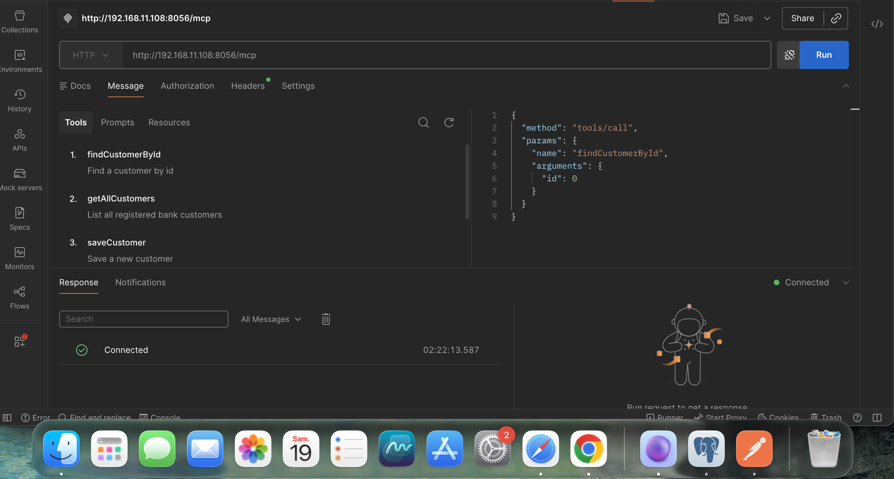

## API principales

### Customer API (`customer-service`)

| Méthode | Chemin | Description |
|---------|--------|-------------|
| `GET` | `/customers` | Liste des clients |
| `GET` | `/customers/{id}` | Client par id |
| `POST` | `/customers` | Création d’un client |

### Account API (`ebank-service`)

| Méthode | Chemin | Description |
|---------|--------|-------------|
| `GET` | `/accounts` | Liste des comptes |
| `GET` | `/accounts/{id}` | Compte par id (client enrichi via Feign) |
| `POST` | `/accounts` | Création d’un compte |

Console H2 (activée sur `ebank-service`) : `http://localhost:8057/h2-console` — JDBC `jdbc:h2:mem:accounts-db`.

### Chatbot API (`ebank-bot`)

| Méthode | Chemin | Paramètres | Description |
|---------|--------|------------|-------------|
| `GET` | `/chat` | `query`, `conversationId` (défaut `default`) | Réponse texte |
| `GET` | `/chattelegram` | idem | Même traitement que `/chat` |
| `GET` | `/chatStream` | idem | Flux texte (streaming) |

### Gateway

Pas de contrôleur dédié : proxy vers les services discovery (`/{serviceId}/**`), CORS global configuré dans `gateway-service/application.yml`.

## MCP

- **customer-service** : outils MCP sur la couche service (`getAllCustomers`, `findCustomerById`, `saveCustomer`).
- **ebank-service** : outils MCP comptes (`getAllBankAccounts`, `getAllBankAccountsById`, `save`).
- **ebank-bot** : client MCP **Streamable HTTP** vers les deux serveurs ; Spring AI enregistre les callbacks outils pour interroger ou modifier les données métier pendant le chat.

Protocole serveur : `spring.ai.mcp.server.protocol=STREAMABLE` sur les deux services métier.

## Dépannage

| Problème | Piste |
|----------|--------|
| Port déjà utilisé | Changer `server.port` ou libérer le processus (8761, 8056–8058, 9999, 4200). |
| Variable d’environnement absente | Erreur au démarrage de `ebank-bot` (clé OpenAI, tokens). |
| Token Discord / Telegram invalide | Vérifier les variables ; pour Telegram, conflit de polling si une autre instance utilise le même token. |
| `conversationId` | Optionnel (défaut `default`) ; Discord/Telegram utilisent l’id de canal/chat pour la mémoire. |
| Message Discord > 2 000 caractères | Le bot decoupe la réponse en segments de 2 000 caractères. |
| MCP indisponible | Démarrer `customer-service` et `ebank-service` avant `ebank-bot` ; vérifier `8056/mcp` et `8057/mcp`. |
| Eureka indisponible | Démarrer `discovery-service` puis les clients Eureka avant la Gateway. |
| Gateway → `EBANK-BOT` en 404 | Eureka désactivé sur `ebank-bot` dans la config actuelle : réactiver le client Eureka ou appeler `http://localhost:8058`. |
| Données vides | Bases H2 en mémoire : redémarrer recrée les jeux de test (`ebank-service` seed au démarrage). |
| Telegram inactif | `telegrambots.enabled=false` par défaut : passer à `true` après configuration du token. |

## Historique fonctionnel

1. Services métier clients et comptes (REST + Swagger).
2. Passage à Eureka (discovery-service).
3. Gateway (config statique puis routage dynamique discovery).
4. OpenFeign entre `ebank-service` et `customer-service`.
5. Tolérance aux pannes (Resilience4j / Circuit Breaker).
6. Module `ebank-bot` et endpoints de chat.
7. Spring AI, mémoire `conversationId`, intégration MCP.
8. Bot Discord.
9. Application Angular (comptes, navigation).
10. Streaming chat, Markdown, intercepteur de chargement.
11. Intégration Telegram.

## Auteur

Projet développé par OumouDev.

## Contact

- [Portfolio](https://oumou100.github.io/)
- [LinkedIn](https://www.linkedin.com/in/kon%C3%A9-oumou-98bb6229a/?lipi=urn%3Ali%3Apage%3Ad_flagship3_profile_verification_details%3BBvDWz7TBRNOQfAbJe62C4A%3D%3D)
